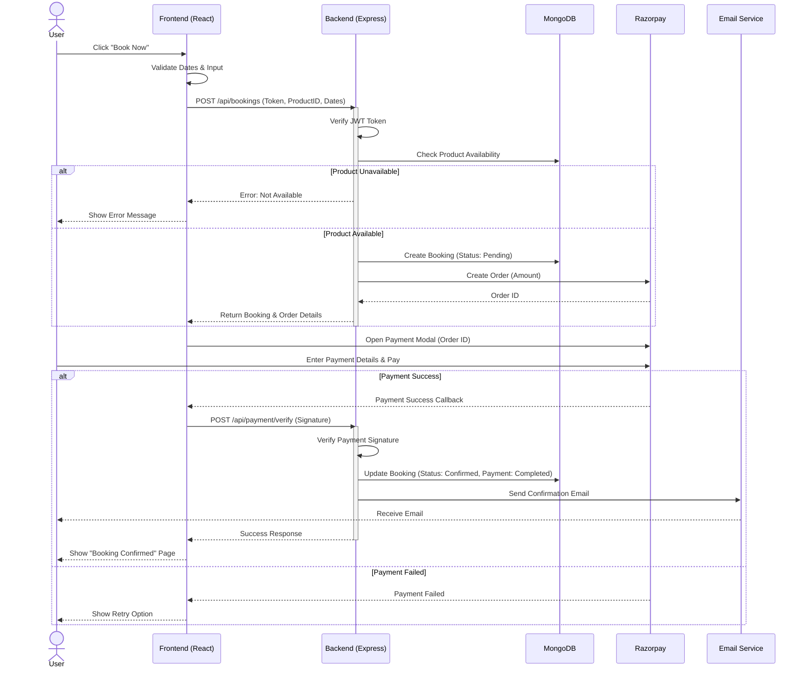
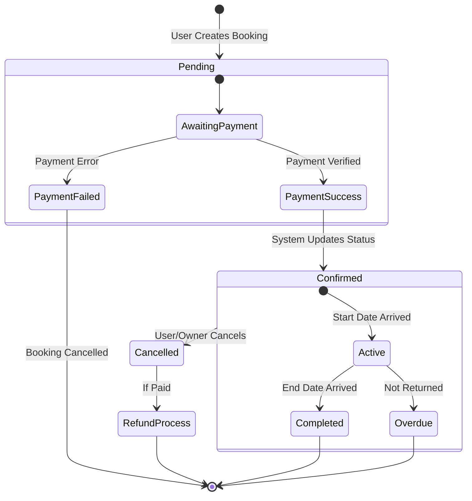

# ElectroRent System Design Document

## 1. High-Level System Design (HLD)

ElectroRent follows a classic **Client-Server Architecture** using the **MERN Stack** (MongoDB, Express.js, React.js, Node.js). It integrates with several third-party services for payments, location, and notifications.

### Architecture Diagram

```mermaid
graph TD
    Client[Client (Browser/Mobile)]
    
    subgraph "Frontend (React)"
        UI[User Interface]
        State[State Management (Context API)]
        Router[React Router]
        API_Client[Axios Client]
    end

    subgraph "Backend (Node.js/Express)"
        Server[Web Server]
        Auth[Auth Middleware (JWT)]
        Controllers[Controllers]
        Services[Services (Payment, Notification)]
        ODM[Mongoose ODM]
    end

    subgraph "Database"
        DB[(MongoDB Atlas)]
    end

    subgraph "External Services"
        GMaps[Google Maps API]
        Razorpay[Razorpay Payment Gateway]
        Email[Nodemailer (SMTP)]
    end

    Client --> UI
    UI --> State
    State --> API_Client
    API_Client -- HTTP/REST --> Server
    
    Server --> Auth
    Auth --> Controllers
    Controllers --> Services
    Controllers --> ODM
    ODM --> DB
    
    UI -- Maps SDK --> GMaps
    Services -- Payment API --> Razorpay
    Services -- SMTP --> Email
```

### Components
1.  **Client (Frontend)**: Single Page Application (SPA) built with React. Handles user interactions, map rendering, and payment modal display.
2.  **Web Server (Backend)**: RESTful API built with Express.js. Handles business logic, authentication, and data validation.
3.  **Database**: MongoDB (NoSQL) stores unstructured data like product specs and geospatial data for location-based search.
4.  **External Services**:
    *   **Google Maps**: Geocoding, Autocomplete, and Map visualization.
    *   **Razorpay**: Payment processing and webhook handling.
    *   **Nodemailer**: Transactional emails (Booking confirmations).

---

## 2. Low-Level System Design (LLD)

### Database Schema (MongoDB)

#### Users Collection
| Field | Type | Description |
|-------|------|-------------|
| `_id` | ObjectId | Unique Identifier |
| `name` | String | Full Name |
| `email` | String | Unique, Indexed |
| `password` | String | Bcrypt Hashed |
| `role` | Enum | `user`, `owner`, `admin` |
| `phone` | String | Contact Number |

#### Products Collection
| Field | Type | Description |
|-------|------|-------------|
| `_id` | ObjectId | Unique Identifier |
| `name` | String | Product Title |
| `category` | String | e.g., 'Laptops', 'Cameras' |
| `pricePerDay`| Number | Daily Rental Rate |
| `location` | GeoJSON | `{ type: "Point", coordinates: [lng, lat] }` |
| `owner` | ObjectId | Reference to `User` |
| `specs` | Map | Flexible key-value pairs for specs |

#### Bookings Collection
| Field | Type | Description |
|-------|------|-------------|
| `_id` | ObjectId | Unique Identifier |
| `product` | ObjectId | Reference to `Product` |
| `user` | ObjectId | Reference to `User` |
| `status` | Enum | `pending`, `confirmed`, `active`, `completed`, `cancelled` |
| `paymentStatus`| Enum | `pending`, `completed`, `failed` |
| `startDate` | Date | Rental Start |
| `endDate` | Date | Rental End |

### API Design (REST)

| Method | Endpoint | Description | Access |
|--------|----------|-------------|--------|
| **Auth** | | | |
| POST | `/api/auth/register` | Register new user | Public |
| POST | `/api/auth/login` | Login user | Public |
| **Products** | | | |
| GET | `/api/products` | List/Filter products | Public |
| GET | `/api/products/search` | Geospatial search | Public |
| POST | `/api/products` | Create listing | Owner |
| **Bookings** | | | |
| POST | `/api/bookings` | Create booking request | User |
| PUT | `/api/bookings/:id` | Update status | User/Owner |

---

## 3. Sequence Diagram (Booking Flow)

This diagram illustrates the complete flow of a user booking a product, paying for it, and receiving confirmation.



---

## 4. Job Diagram (Booking Lifecycle Workflow)

This diagram represents the state machine and workflow of a booking "job" within the system.



### Job Processing Steps (Backend Logic)
1.  **Availability Check Job**: Before creating a booking, the system scans the `Bookings` collection for any overlapping intervals for the same `productId`.
2.  **Payment Verification Job**: Upon receiving the Razorpay webhook or frontend callback, the system cryptographically verifies the signature to prevent fraud.
3.  **Notification Job**: Asynchronous function (`sendBookingNotification`) triggers email dispatch via Nodemailer based on state transitions (Created -> Confirmed -> Cancelled).
